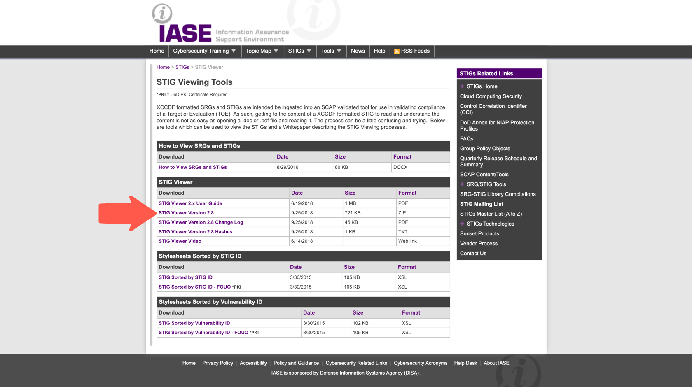
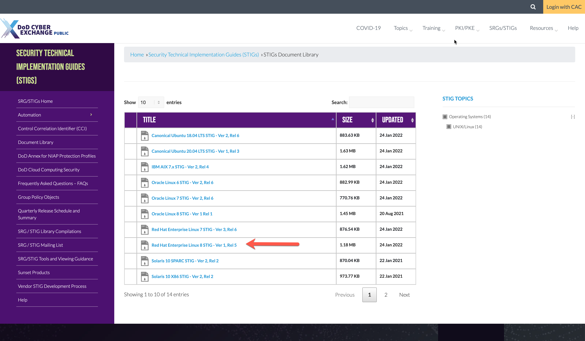

## 9. From STIG to Profile

### 9.1 Download STIG Requirements Here

Download the latest STIG Viewer located here [STIG Viewer](https://public.cyber.mil/stigs/srg-stig-tools/)



Download the `Red Hat Enterprise Linux 8 STIG - Ver 1, Rel 5` located here [RHEL8 STIG Download](https://public.cyber.mil/stigs/downloads/?_dl_facet_stigs=operating-systems%2Cunix-linux)



### 9.2 Example Control SV-230502

Let's take a look at how we would write the InSpec control for SV-230502:

```ruby
control 'SV-230502' do
  title 'The RHEL 8 file system automounter must be disabled unless required.'
  desc  "Automatically mounting file systems permits easy introduction of
unknown devices, thereby facilitating malicious activity."
  desc  'rationale', ''
  desc  'check', "
    Verify the operating system disables the ability to automount devices.

    Check to see if automounter service is active with the following command:

    Note: If the autofs service is not installed, this requirement is not
applicable.

    $ sudo systemctl status autofs

    autofs.service - Automounts filesystems on demand
    Loaded: loaded (/usr/lib/systemd/system/autofs.service; disabled)
    Active: inactive (dead)

    If the \"autofs\" status is set to \"active\" and is not documented with
the Information System Security Officer (ISSO) as an operational requirement,
this is a finding.
  "
  desc 'fix', "
    Configure the operating system to disable the ability to automount devices.

    Turn off the automount service with the following commands:

    $ sudo systemctl stop autofs
    $ sudo systemctl disable autofs

    If \"autofs\" is required for Network File System (NFS), it must be
documented with the ISSO.
  "
  impact 0.5
  tag severity: 'medium'
  tag gtitle: 'SRG-OS-000114-GPOS-00059'
  tag gid: 'V-230502'
  tag rid: 'SV-230502r627750_rule'
  tag stig_id: 'RHEL-08-040070'
  tag fix_id: 'F-33146r568253_fix'
  tag cci: ['CCI-000778']
  tag nist: ['IA-3']

  if virtualization.system.eql?('docker')
    impact 0.0
    describe "Control not applicable within a container" do
      skip "Control not applicable within a container"
    end
  else
    if package('autofs').installed?
      describe systemd_service('autofs.service') do
        it { should_not be_running }
        it { should_not be_enabled }
        it { should_not be_installed }
      end
    else
      impact 0.0
      describe 'The autofs service is not installed' do
        skip 'The autofs service is not installed, this control is Not Applicable.'
      end
    end
  end
end
```

### 9.3 Getting Started on the RHEL8 baseline

**Controls we will demo:**

- SV-230324 <---login_defs resource
- SV-230250 <---directory resource
- SV-230243 <---directory looping & file resource
- SV-230505 <---non applicable use case & package resource

**Suggested Controls to start on (Simple):**

- SV-230383 <---login_defs resource
- SV-230249 <---directory resource
- SV-230242 <---directory looping & file resource
- SV-230241 <---non applicable use case & package resource

**Suggested Controls to start on (Hard):**

- SV-230281 <---parse config file
- SV-230365 <---login_defs resource
- SV-230264 <---file content

**Suggested InSpec Resources to use:**

- [command](https://www.inspec.io/docs/reference/resources/command/)
- [file](https://www.inspec.io/docs/reference/resources/file/)
- [directory](https://www.inspec.io/docs/reference/resources/directory/)
- [parse_config_file](https://www.inspec.io/docs/reference/resources/parse_config_file/)
- [package](https://www.inspec.io/docs/reference/resources/package/)
- [login_defs](https://docs.chef.io/inspec/resources/login_defs/)

### 9.4 Completed RHEL8 Profile for Reference

Below is the url to the completed RHEL8 Inspec Profile for reference.  
[redhat-enterprise-linux-8-stig-baseline](https://github.com/CMSgov/redhat-enterprise-linux-8-stig-baseline)
